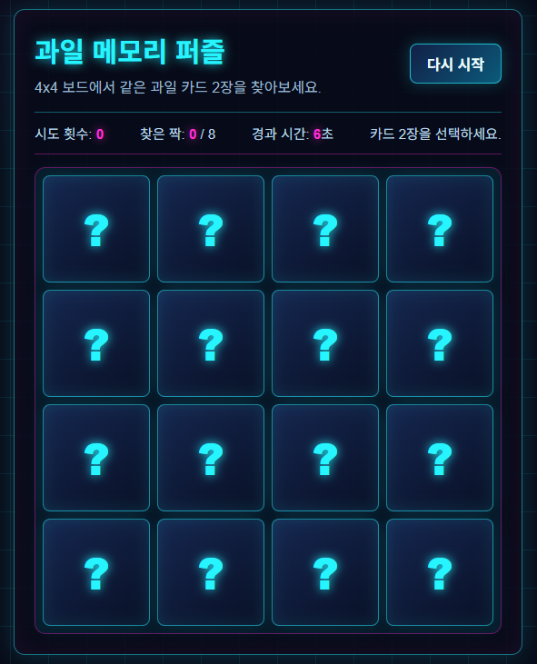

# Puzzle Game

4x4 보드에서 같은 과일 카드 2장을 찾아 맞추는 메모리 퍼즐 게임입니다.  
순수 HTML, CSS, JavaScript로 구성되어 있으며 별도의 빌드 도구나 서버 없이 브라우저에서 실행할 수 있습니다.

## 실행 방법

`index.html` 파일을 브라우저에서 열면 바로 게임이 시작됩니다.

## 폴더 구조

```text
puzzle-game/
├── index.html
├── css/
│   └── styles.css
├── js/
│   ├── app.js
│   ├── board.js
│   ├── game.js
│   └── utils.js
└── PRD.md
```

## 파일별 역할

### `index.html`

게임 화면의 기본 구조를 정의합니다.

- 게임 제목과 설명
- 다시 시작 버튼
- 시도 횟수, 찾은 짝 수, 경과 시간, 안내 메시지
- 카드가 배치될 게임 보드
- JavaScript 파일 로딩

스크립트는 아래 순서로 로드됩니다.

```html
<script src="js/utils.js"></script>
<script src="js/board.js"></script>
<script src="js/game.js"></script>
<script src="js/app.js"></script>
```

이 순서가 중요합니다. 뒤 파일들이 앞 파일에서 만든 상수, 함수, DOM 요소를 사용하기 때문입니다.

### `js/utils.js`

게임에서 공통으로 사용하는 값과 카드 생성 로직을 담당합니다.

- `BOARD_SIZE`: 보드 크기입니다. 현재 값은 `4`라서 4x4 보드가 됩니다.
- `MATCH_SIZE`: 한 번에 비교할 카드 수입니다. 현재 값은 `2`입니다.
- `FLIP_BACK_DELAY`: 카드가 틀렸을 때 다시 닫히기까지의 시간입니다.
- `fruits`: 카드에 들어갈 과일 데이터입니다.
- `shuffle(items)`: 배열을 무작위로 섞습니다.
- `createCards()`: 과일 8종을 2장씩 복제해 총 16장의 카드 데이터를 만들고 섞습니다.

카드 데이터는 대략 아래 형태입니다.

```js
{
  id: 0,
  fruit: {
    key: "apple",
    name: "사과",
    color: "#ff4d6d",
    accent: "#ffd166"
  },
  isOpen: false,
  isMatched: false
}
```

### `js/board.js`

현재 게임 상태를 HTML 화면으로 그리는 역할을 합니다.

- 보드 DOM 요소를 찾습니다.
- 시도 횟수, 매칭 수, 경과 시간을 화면에 반영합니다.
- `state.cards` 배열을 돌면서 카드 버튼을 생성합니다.
- 카드가 열렸거나 맞춰진 상태면 과일을 보여줍니다.
- 카드가 닫힌 상태면 `?`를 보여줍니다.

핵심 함수는 `renderBoard()`입니다.

```js
function renderBoard() {
  boardElement.innerHTML = "";
  boardElement.style.setProperty("--board-size", BOARD_SIZE);

  tryCountElement.textContent = state.tryCount;
  matchCountElement.textContent = state.matchCount;
  timeCountElement.textContent = state.elapsedSeconds;

  state.cards.forEach(function (card) {
    const cardButton = createCardElement(card);
    boardElement.appendChild(cardButton);
  });
}
```

화면은 매번 기존 보드를 지운 뒤, 현재 `state`를 기준으로 다시 그려집니다.

### `js/game.js`

게임의 핵심 로직을 담당합니다.

`state` 객체 안에 현재 게임 상태가 저장됩니다.

```js
const state = {
  cards: [],
  selectedCards: [],
  tryCount: 0,
  matchCount: 0,
  elapsedSeconds: 0,
  timerId: null,
  isChecking: false,
  isGameCleared: false,
};
```

각 값의 의미는 다음과 같습니다.

- `cards`: 전체 카드 16장
- `selectedCards`: 현재 사용자가 뒤집은 카드들
- `tryCount`: 두 장을 선택한 횟수
- `matchCount`: 맞춘 짝 수
- `elapsedSeconds`: 경과 시간
- `timerId`: 타이머 ID
- `isChecking`: 두 장을 비교하는 중인지 여부
- `isGameCleared`: 게임 완료 여부

### `js/app.js`

애플리케이션의 시작점입니다.

```js
const restartButton = document.querySelector("#restart-button");

restartButton.addEventListener("click", startGame);

startGame();
```

다시 시작 버튼에 `startGame()`을 연결하고, 페이지가 열리면 즉시 새 게임을 시작합니다.

## 게임 흐름

### 1. 게임 시작

`startGame()`이 호출되면 기존 타이머를 멈추고 게임 상태를 초기화합니다.

```js
function startGame() {
  stopTimer();

  state.cards = createCards();
  state.selectedCards = [];
  state.tryCount = 0;
  state.matchCount = 0;
  state.elapsedSeconds = 0;
  state.isChecking = false;
  state.isGameCleared = false;

  renderBoard();
  startTimer();
}
```

이때 `createCards()`가 16장의 섞인 카드 데이터를 새로 만듭니다.

### 2. 카드 선택

사용자가 카드를 클릭하면 `selectCard(cardId)`가 실행됩니다.

```js
function selectCard(cardId) {
  const card = state.cards.find(function (item) {
    return item.id === cardId;
  });

  if (shouldIgnoreClick(card)) {
    return;
  }

  card.isOpen = true;
  state.selectedCards.push(card);
  renderBoard();

  if (state.selectedCards.length === MATCH_SIZE) {
    state.tryCount += 1;
    state.isChecking = true;
    checkSelectedCards();
  }
}
```

클릭한 카드는 열린 상태가 되고 `selectedCards`에 저장됩니다.  
선택한 카드가 2장이 되면 시도 횟수를 증가시키고 정답인지 확인합니다.

### 3. 클릭 무시 조건

`shouldIgnoreClick(card)`는 클릭해도 되는 카드인지 검사합니다.

아래 경우에는 클릭을 무시합니다.

- 두 카드를 비교하는 중일 때
- 게임이 이미 끝났을 때
- 카드가 존재하지 않을 때
- 이미 열린 카드일 때
- 이미 맞춘 카드일 때

```js
function shouldIgnoreClick(card) {
  return (
    state.isChecking ||
    state.isGameCleared ||
    !card ||
    card.isOpen ||
    card.isMatched
  );
}
```

### 4. 정답 확인

`checkSelectedCards()`는 선택된 두 카드의 `fruit.key`를 비교합니다.

```js
function checkSelectedCards() {
  const firstCard = state.selectedCards[0];
  const secondCard = state.selectedCards[1];

  if (firstCard.fruit.key === secondCard.fruit.key) {
    markSelectedCardsAsMatched();
    return;
  }

  closeSelectedCardsAfterDelay();
}
```

두 카드의 `fruit.key`가 같으면 같은 과일입니다.

### 5. 정답인 경우

같은 과일이면 `markSelectedCardsAsMatched()`가 실행됩니다.

- 선택된 두 카드를 `isMatched = true`로 변경합니다.
- 맞춘 짝 수를 1 증가시킵니다.
- 선택 목록을 비웁니다.
- 다시 클릭할 수 있도록 `isChecking`을 `false`로 바꿉니다.
- 화면을 다시 그립니다.
- 게임이 끝났는지 확인합니다.

### 6. 오답인 경우

다른 과일이면 `closeSelectedCardsAfterDelay()`가 실행됩니다.

- 오답 메시지를 보여줍니다.
- `FLIP_BACK_DELAY`만큼 기다립니다.
- 선택된 두 카드의 `isOpen`을 `false`로 바꿔 다시 닫습니다.
- 선택 목록을 비웁니다.
- 다시 클릭할 수 있도록 `isChecking`을 `false`로 바꿉니다.
- 화면을 다시 그립니다.

현재 `FLIP_BACK_DELAY`는 `800`이므로 0.8초 뒤에 카드가 닫힙니다.

### 7. 게임 클리어

`checkClear()`는 맞춘 짝 수가 전체 과일 수와 같은지 확인합니다.

```js
function checkClear() {
  if (state.matchCount !== fruits.length) {
    return;
  }

  state.isGameCleared = true;
  stopTimer();
  statusElement.classList.add("win");
}
```

과일은 8종이고 각 과일이 2장씩 있으므로, `matchCount`가 8이 되면 게임이 끝납니다.

## 핵심 로직 요약

이 게임은 아래 흐름을 반복합니다.

```text
게임 시작
→ 카드 16장 생성
→ 카드 섞기
→ 보드 렌더링
→ 사용자가 카드 클릭
→ 카드 열기
→ 2장이 선택되면 비교
→ 같으면 매칭 처리
→ 다르면 잠시 후 다시 닫기
→ 8쌍을 모두 맞추면 게임 종료
```

핵심은 `state` 객체입니다.  
사용자가 클릭할 때마다 `state`가 바뀌고, `renderBoard()`가 그 상태를 기준으로 화면을 다시 그립니다.

## 타이머 로직

`startTimer()`는 1초마다 `elapsedSeconds`를 증가시키고 화면에 반영합니다.

```js
function startTimer() {
  state.timerId = setInterval(function () {
    state.elapsedSeconds += 1;
    timeCountElement.textContent = state.elapsedSeconds;
  }, 1000);
}
```

`stopTimer()`는 실행 중인 타이머가 있으면 정리합니다.

게임을 다시 시작할 때도 먼저 `stopTimer()`를 호출합니다.  
이렇게 해야 이전 타이머가 계속 남아서 시간이 중복으로 증가하는 문제를 막을 수 있습니다.

## 화면 렌더링 방식

이 프로젝트는 복잡한 프레임워크를 쓰지 않고 DOM을 직접 조작합니다.

카드 상태에 따라 화면이 다르게 표시됩니다.

- `isOpen === true`: 카드가 열려 과일이 보임
- `isMatched === true`: 맞춘 카드이며 비활성화됨
- 둘 다 `false`: 닫힌 카드이며 `?` 표시

즉, 화면은 별도의 데이터를 갖고 있지 않고 항상 `state.cards`를 기준으로 다시 만들어집니다.

## 실행 화면



## 참고 사항

일부 파일의 한글 문자열이 깨져 보일 수 있습니다.  
JavaScript 문법 검사는 통과하지만, 브라우저에서 표시되는 문구가 깨진다면 파일 인코딩을 UTF-8로 다시 저장하는 것이 좋습니다.
